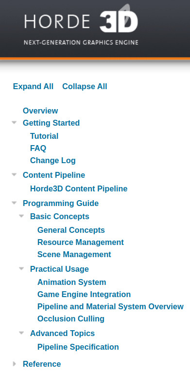

# Engine Investigation

For this portion of the assignment, you are going to review some source code to understand the structure of a game engine. 

**You will be modifying this README.md with your answeres (Search for TODO)**

## Horde3D Graphics Engine

Horde3D is a small and simple graphics engine. It was designed primarily to be integrated with other game engines and frameworks. Some features of the Horde3D engine are:

- It is a small graphics engine that supposedly has a relatively clean API.
- It is cross platform and uses the OpenGL API.
- It specializes in crowd simulation

### Your task

Review the Horde3D reference manual here: http://horde3d.org/docs/manual.html You should read the manual in its entirety such that you can answer the following questions:

- Question: What might be the advantage of a handle-based system?
  - Answer: *TODO Put your answer here*
- Question: What is one pro and one con of creating a C-based API with your engine?
  - Answer: *TODO Put your answer here*
- Question: What is a scene graph?
  - Answer: *TODO Put your answer here*
- Question: What is a Pipeline in Horde3D? In your answer, discuss the purpose of having a 'pipeline XML document' in the context of an engine.
  - Answer: *TODO Put your answer here*

## GoDot Game Engine

The Godot game engine(https://godotengine.org/) is a free and open-source engine gaining lots of popularity in the past few years. Some features are:

- Cross platform game engine
- Free open source engine

Please read the following article and answer.

- Question: Read the following article (https://godotengine.org/article/why-isnt-godot-ecs-based-game-engine/) and answer in your own words -- how is the GoDot engine organized at a high-level?
  - Answer: *TODO Put your answer here*

## Your Choice Engine/Framework

Pick one game engine that is listed here: https://gist.github.com/raysan5/909dc6cf33ed40223eb0dfe625c0de74

Answer the following to the best of your ability (There may be 1 or 2 that you cannot answer -- if you cannot answer too many questions, choose a different engine to receive full credit.):

- Question: Which engine did you choose?
  - Answer: *TODO Put your answer here*
- Question: Is the engine implemented primarily in C++
  - Answer: *TODO Put your answer here*
- Question: Is there a scripting languages available with the engine?
  - Answer: *TODO Put your answer here*
- Question: Were there any commercial/indie games made in this engine?
  - Answer: *TODO Put your answer here*
- Question: What platforms does the engine support?
  - Answer: *TODO Put your answer here*
- Question: Were there any Game Developer Conference or other interesting talks? (May need to search YouTube, try to find at least one presentation video or slideshow talking about the technical parts of the engine, code, or a game made with the engine and link it here.)
  - Answer: *TODO Put your answer here*
- Question: What is the engines 'best' feature (i.e. why do people tend to use it? You may need to visit the website to get an idea.)
  - Answer: *TODO Put your answer here*
- Question: Is the code available?
  - Answer: *TODO Put your answer here*
- Question: What is one interesting thing you learned looking at the engine or the code, that you think you can implement in your codebase?
  - Answer: *TODO Put your answer here*

## Deliverable

1. Modify this readme.md file with your answers.

## F.A.Q

- Q: How long do my answers need to be?
- A: Long enough that your answers are complete -- some can be 'yes/no' answers, but add details. Show your interest!
