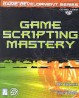
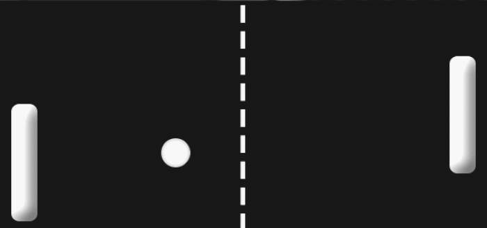
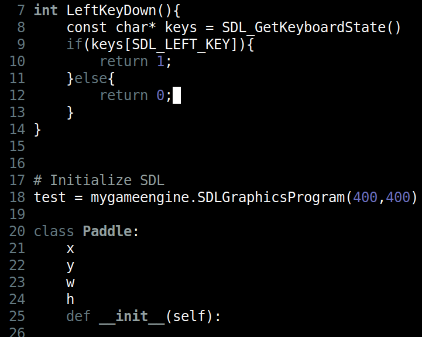
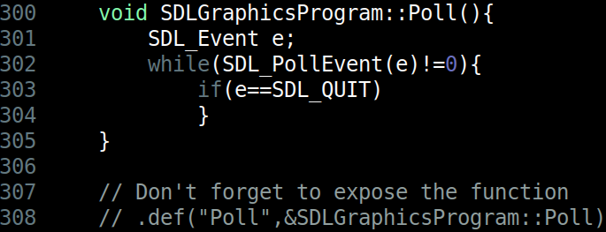

# Assignment - Scripting



> Scripting! $1,000,000 product

## Logistics

You will be working on your own laptop today.

## Helpful Resources

Some additional resources to help you through this lab assignment

- [https://www.youtube.com/playlist?list=PLvv0ScY6vfd90tV5g_wzbkfCZ8iR9qSMK](My Youtube Playlist on setting up and working with Pybind11 and C++)
    - I recommend you start here for setting up Pybind11.
- Using Visual Studio with Pybind11
    - https://docs.microsoft.com/en-us/visualstudio/python/working-with-c-cpp-python-in-visual-studio?view=vs-2019  
- An example of Pybind in a graphics engine
    - [Embedding Python in the Ogre3D engine](https://www.youtube.com/watch?v=P9edayG8rkg)
- Pybind Documentation
    - https://pybind11.readthedocs.io/en/stable/basics.html
  Pybind blog
    - [Extending Python With C Or C++ With Pybind11](https://blog.conan.io/2016/04/12/Extending-python-with-C-or-C++-with-pybind11.html)

# Introduction

For this assignment you are going to work on exposing your engine internals to the Python programming language using pybind11. There exist many advantages to using a scripting language to enable folks access to your game engine from a different language. There are of course tradeoffs in terms of adding some additional code to expose your engine to Python. Luckily, the pybind11 interface makes this relatively easy.

The immediate difficulty will be primarily in getting things setup -- be forewarned! Reading documentation is key https://pybind11.readthedocs.io/en/stable/

# Task 1 - Try compiling the sample

Provided in the root directory is a sample [pybind.cpp](./pybind.cpp). Within the source file are directions on how to build the sample for your respective operating system. For example, on Ubuntu run:

```
clang++ -shared -fPIC -std=c++11 -I./pybind11/include/ `python3.5 -m pybind11 --includes` pybind.cpp -o mymodule.so `python3.5-config --ldflags`
```

Note: Some folks may have python3.6,python3.7,python 3.11, etc. and need to change flags appropraitely to match the version on their system in both python and python-config shown above.

After building successfully, you will have a *mymodule* library that you can import into python3.X (where 'X' is your version of python). See the bottom as an example.

```python
$ python3
>>> import mymodule
>>> help(mymodule)
Help on module mymodule:

NAME
    mymodule - example plugin

CLASSES
    pybind11_builtins.pybind11_object(builtins.object)
        Pet

    class Pet(pybind11_builtins.pybind11_object)
     |  Method resolution order:
     |      Pet
     |      pybind11_builtins.pybind11_object
     |      builtins.object
     |
     |  Methods defined here:
     |
     |  __init__(...)
     |      __init__(self: mymodule.Pet, arg0: str) -> None
     |
     |  getName(...)
     |      getName(self: mymodule.Pet) -> str
     |
     |  setName(...)
     |      setName(self: mymodule.Pet, arg0: str) -> None

```

Here is an example of actually using our module. Again, this is your C or C++ engine running as a library within in Python3.X!

```python
>>> import mymodule
>>> mymodule.add(1,2)
3
```

Another example, this time using classes!

```python
>>> import mymodule
>>> p = mymodule.Pet('moe')
>>> print(p)
<mymodule.Pet object at 0x000000000319c650>
>>> p.getName()
'moe'
>>> p.setName('test')
>>> p.getName()
'test'
```

Note: If you have difficulty setting up Pybind11, I have a series of videos here that may be useful: https://www.youtube.com/playlist?list=PLvv0ScY6vfd90tV5g_wzbkfCZ8iR9qSMK

# Task 2 - Pong (EngineLibrary Folder)



Navigate to the [./EngineLibrary](./EngineLibrary) directory. Once again, build the engine library and make sure pybind11 is working. If for some reason pybind11 does not work, then confirm with the small sample in part 1 that you are performing the same steps.

Your deliverable for part 2, will be to implement a pong game in a Python script using the pybind interface to your C++ code. The pong game itself can be very simple (no need to have fancy menus, just two paddles that can bounce a ball back and forth. Your game still needs to detect collision, and bounce the ball back and forth as paddles move, bounce the ball at angles, collide with the paddles, and the ball should reset however). 

The goal is to see how you can separate the logic of the game in Python, while the heavy duty tasks (i.e. rendering graphics) are handled on the C++ side.

Note: One of the challenges will be to write a few functions to get input from SDL and expose those functions to Python (e.g. a 'IsUpKeyDown()' or 'IsWKeyDown()) functions may be helpful.)

### Compiling and running the support code

* (See directions in the [./EngineLibrary](./EngineLibrary) folder)

## Deliverables

- Implement pong in a Python script using the pybind interface to your C++ code.

## Going Further

What is that, you finished Early? Did you enjoy this assignment? Here are some (optional) ways to further this assignment.

- Read more on Pybind11
- Watch a lua tutorial and try to implement lua.h and support two programming langauges!
  - https://luajit.org/ LuaJIT is supposedly the state of the art for LUA embedding for speed in games.

## F.A.Q. (Instructor Anticipated Questions)

- Q: How do I structure my code?
  - A: Very rough sketch that came out of office hours.
  - 
-Q: What if my application is not responding?
  - A: Try polling and handling events in your python. Perhaps create a function?
  - 

## Found a bug?

If you found a mistake (big or small, including spelling mistakes) in this lab, kindly send me an e-mail. It is not seen as nitpicky, but appreciated! (Or rather, future generations of students will appreciate it!)

- Fun fact: The famous computer scientist Donald Knuth would pay folks one $2.56 for errors in his published works. [[source](https://en.wikipedia.org/wiki/Knuth_reward_check)]
- Unfortunately, there is no monetary reward in this course :)
