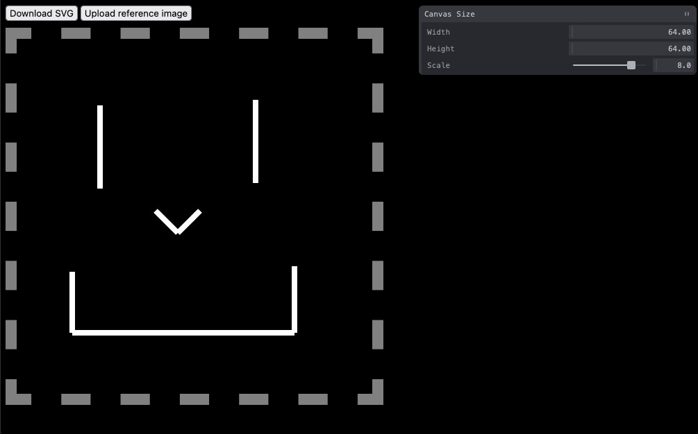

# Simple SVG editor

## Running prebuilt version

Open `dist/index.html` in your favorite browser.

## Building and developing

1. Ensure you have Node.js 20 installed.
2. In the root directory, run `npm install && npm start`.
3. Navigate to http://localhost:1234/. You should see an editor pop up.